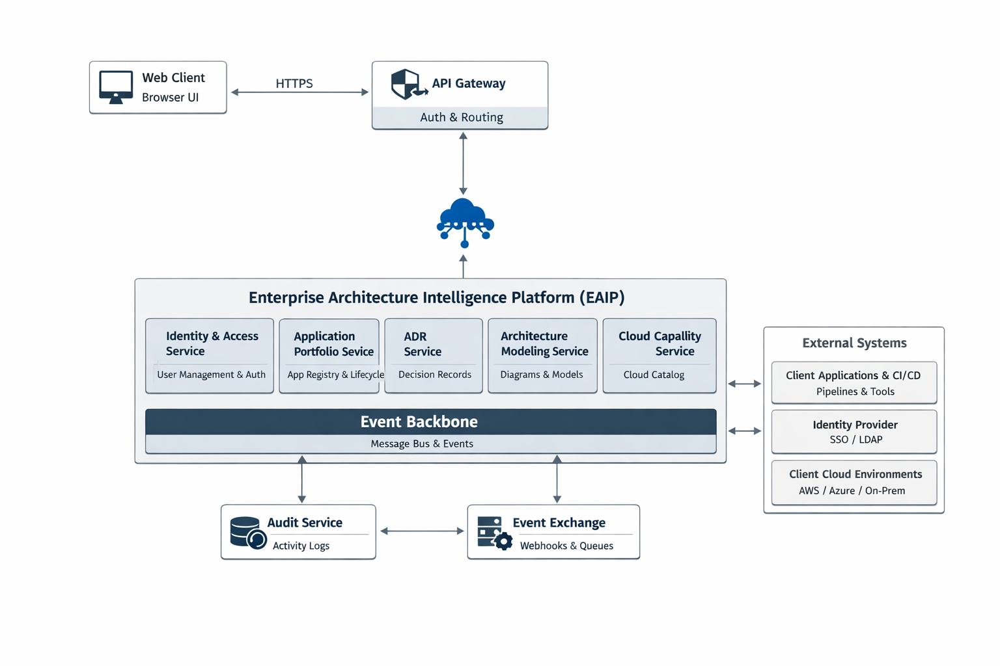

# C4 – Container Diagram (Level 2)

## Purpose

This document defines the **Container View (C4 Level 2)** for the  
**Enterprise Architecture Intelligence Platform (EAIP)**.

It answers:
- What are the major containers inside EAIP?
- What responsibilities does each container have?
- How do containers communicate with each other?
- Where do data and events flow?

This view is intended for:
- Architects
- Platform engineers
- Security reviewers
- DevOps teams

---

## Containers Overview

EAIP is composed of **multiple logical containers**, aligned with bounded contexts and deployment boundaries.

---

## 1. Web Client (UI)

**Type**  
- Web Application (SPA)

**Responsibilities**
- User interaction
- Diagram visualization
- Portfolio dashboards
- Subscription and integration management

**Communicates With**
- API Gateway (HTTPS)

**Key Characteristics**
- Stateless
- Token-based authentication
- No business logic

---

## 2. API Gateway

**Type**  
- Edge Gateway

**Responsibilities**
- Authentication & authorization
- Request routing
- Rate limiting & throttling
- API versioning
- Input validation

**Communicates With**
- Application Services (HTTPS)
- Identity Provider
- Event Ingress Endpoint

**Key Rule**
- All external traffic flows through this container

---

## 3. Identity & Access Service

**Type**  
- Backend Service

**Responsibilities**
- User management
- Role & permission enforcement
- Workspace isolation

**Data Store**
- Identity Store (Logical)

**Publishes Events**
- User.Created
- Role.Assigned
- Permission.Granted

---

## 4. Workspace Service

**Type**  
- Backend Service

**Responsibilities**
- Workspace lifecycle
- Organization profiles
- Compliance configuration

**Data Store**
- Workspace Metadata Store

**Publishes Events**
- Workspace.Created
- Workspace.Updated

---

## 5. Application Portfolio Service

**Type**  
- Backend Service

**Responsibilities**
- Application registry
- Business unit ownership
- Lifecycle management

**Data Store**
- Application Metadata Store

**Publishes Events**
- Application.Created
- Application.Updated
- Application.Sunset

---

## 6. ADR Service

**Type**  
- Backend Service

**Responsibilities**
- Architecture Decision Records
- Approval workflows
- Decision versioning

**Data Store**
- ADR Store

**Publishes Events**
- ADR.Created
- ADR.Approved
- ADR.Superseded

---

## 7. Architecture Modeling Service

**Type**  
- Backend Service

**Responsibilities**
- Diagram creation and versioning
- Typed nodes and relationships
- Diagram validation

**Data Stores**
- Diagram Metadata Store
- Diagram Object Store

**Publishes Events**
- Diagram.Created
- Diagram.Published

---

## 8. Cloud Capability Service

**Type**  
- Backend Service

**Responsibilities**
- Canonical capability definitions
- Cloud provider mappings
- Feature parity assessment

**Data Store**
- Capability Store

**Publishes Events**
- Capability.Created
- Capability.Mapped

---

## 9. Roadmap & Transformation Service

**Type**  
- Backend Service

**Responsibilities**
- Current vs target architecture
- Migration planning
- Risk tracking

**Data Store**
- Roadmap Store

**Publishes Events**
- Roadmap.Created
- MigrationStep.Added

---

## 10. Event Exchange Service

**Type**  
- Backend Service

**Responsibilities**
- Event catalog
- Subscription management
- Webhook and queue delivery
- Retry and DLQ handling

**Data Store**
- Subscription Store
- Delivery Logs

**Consumes Events**
- All domain events

**Publishes Events**
- Event.Delivered
- Event.Failed

---

## 11. Activity & Audit Service

**Type**  
- Backend Service

**Responsibilities**
- Activity timeline
- Audit logging
- Compliance reporting

**Data Store**
- Append-only Audit Store

**Consumes Events**
- All domain events

---

## 12. Event Backbone

**Type**  
- Messaging Infrastructure (Logical)

**Responsibilities**
- Asynchronous event delivery
- Decoupling of containers
- Event durability and replay

**Used By**
- All backend services

---

## 13. Search & Analytics Store

**Type**  
- Indexed Data Store (Logical)

**Responsibilities**
- Full-text search
- Portfolio insights
- Reporting queries

**Consumes**
- Domain and audit events

---

## Container Communication Summary

### Synchronous (HTTP)
- Web Client → API Gateway
- API Gateway → Backend Services

### Asynchronous (Events)
- Backend Services → Event Backbone
- Event Backbone → Backend Services
- Event Exchange → External Systems

---

## Container Diagram (Textual)

---

## Security Boundaries

- API Gateway enforces edge security
- Services authenticate internally
- Event delivery is signed and audited
- Data stores are isolated per service

---

## Out of Scope

- Internal component design
- Database technologies
- Cloud vendor specifics

These are addressed in **C4 Component Diagrams**.

---

## Status

This document defines the **authoritative container architecture** for EAIP.

All deployments and implementations must align with this structure.

